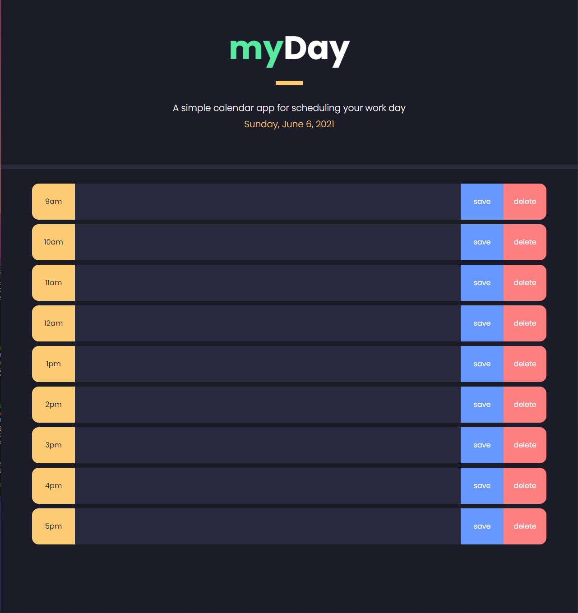
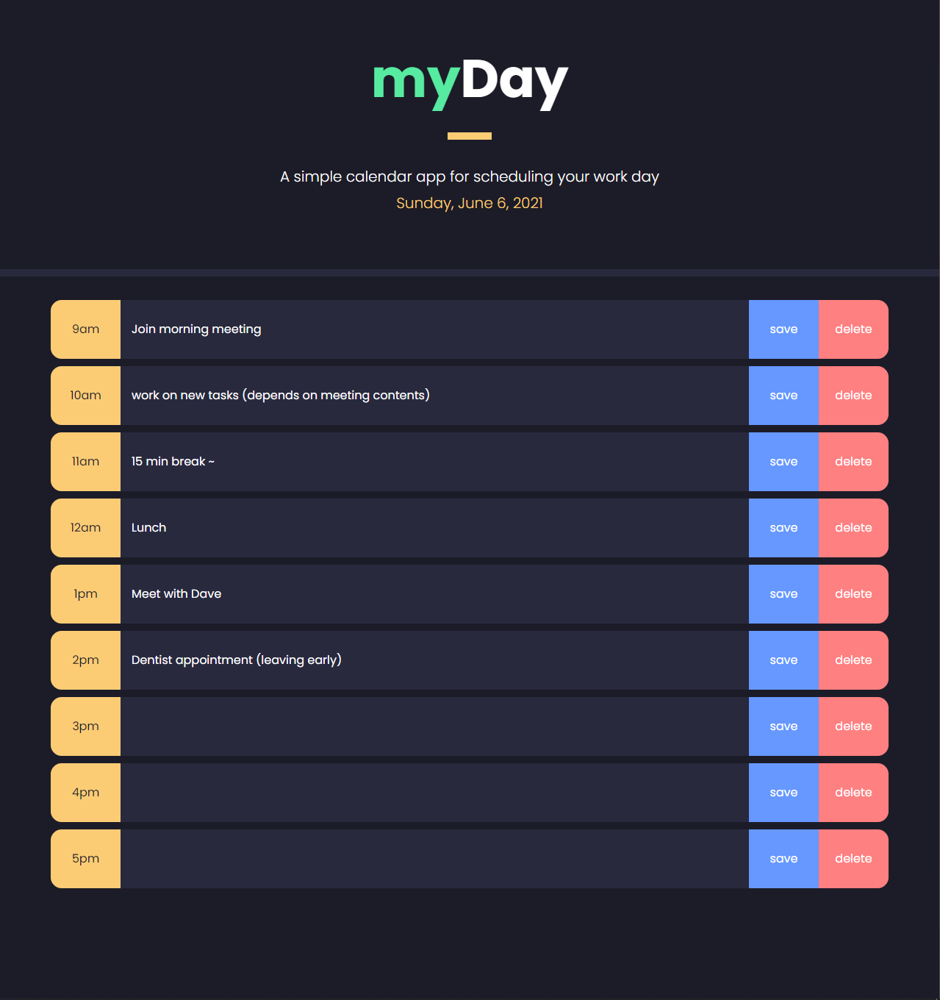

# myDay schedule app

## About This Project

#### The myDay application serves as a solution to those with busy workday schedules who would like to log their activities during specific hours during a working day with an interactive and user friendly interface.

## How it works:

#### The program allows you to create and save tasks as well as delete them during 1 hour blocks throughout an average 9-5 working day.
#### Even if you refresh the application work tasks will stay on the page. We store your tasks into local storage.
#### You may close out of the application and come back to it at any time to view your activities at you convenience.

### Empty schedule

### Schedule Filled out

## Motivation:

#### I wanted to create an application that allows individuals with busy schedules to log their activities throughout the day. I also wanted to application to allow you to delete events since people with busy schedules often have to reschedule. The visual representation of your activities throughout the hours of the day helps determine quickly and efficiently what you can move around for other activities.

## Challenges:

#### It was very difficult to set up a selector which would index over every hour of the day to understand where I would then set my stored Task information. I initially attempted to connect all of the buttons with a function that listened for any event that took place within a container that held all the divs but found it was inefficient and difficult. I opted to use a on click function for my save button that would send my user input into the local storage and then set the value of each of my divs to my user input by getting the items from local storage.